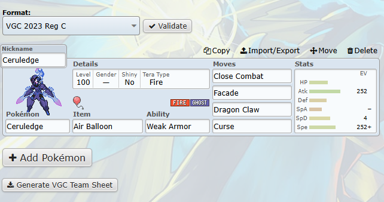

# Showdown VGC Team Sheet Extension

This extension allows users to generate a printable VGC team sheet directly from their Pokémon Showdown teams. It fills out a PDF form with the team's details, making it easy to print and use during local competitions.

It's intended to ease the process of creating physical team sheets for VGC events by automating it with data from [Pokémon Showdown](https://pokemonshowdown.com).

> [!WARNING]
> Remember to double-check the generated PDF before printing.

## Features

- Add a button to the Pokémon Showdown team builder interface.
- Generates a downloadable PDF ready for printing.
- Automatically fills in Pokémon details including name, moves, items, tera type, and stats.

## Screenshots

## Installation

Install via extension marketplace

- [Chrome Web Store](https://chromewebstore.google.com/detail/hhmgmifkiefbakippglilgcfnndlkbab?utm_source=item-share-cb)
- [Firefox Add-ons](https://addons.mozilla.org/en-GB/firefox/addon/showdown-vgc-team-sheet)

Or install manually

1. Download the latest release from the [Releases](https://github.com/kasp470f/ShowdownVGCTeamSheet/releases) page.
2. Unzip the downloaded file.
3. Load the extension in your browser:
    - For Chrome: Go to `chrome://extensions/`, enable "Developer mode", click "Load unpacked", and select the unzipped folder.
    - For Firefox: Go to `about:addons`, go to Extensions, click the gear icon, select "Install Add-on From File...", and choose the unzipped folder.

## Credits

Made with ❤️ by [Kasper Wissendorf](https://github.com/kasp470f)

A special thanks to [alchemistake](https://github.com/alchemistake)🔥 for providing the original PDF template.

And of course without the amazing work of the [Pokémon Showdown](https://pokemonshowdown.com) team, this extension wouldn't be possible.
